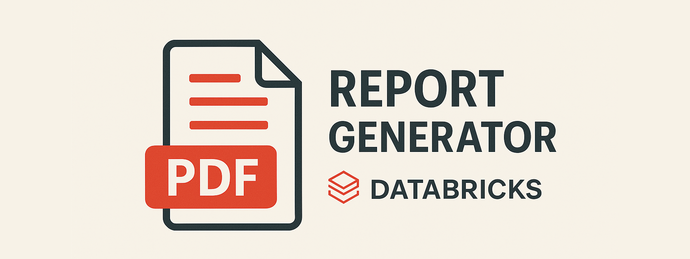

<!-- PROJECT LOGO -->
 

  

<h3 align="center">Report Generator via Database</h3>

  

    Sistema automatizado para geração e envio de extratos em PDF a partir de dados integrados.
     

  

 
<!-- SUMÁRIO -->

  
Sumário

  <ol>
    <li>
      <a href="#sobre-o-projeto">Sobre o projeto</a>
      <ul>
        <li><a href="#construído-com">Construído com</a></li>
      </ul>
    </li>
    <li>
      <a href="#usuabilidade">Usabilidade</a>
      <ul>
        <li><a href="#exemplos-de-resultados-gerados">Exemplos de resultados gerados</a></li>
      </ul>
    </li>
    <li><a href="#license">Licença</a></li>
    <li><a href="#contact">Contato</a></li>
  </ol>

<!-- ABOUT THE PROJECT -->
## Sobre o projeto

Sistema automatizado para geração de extratos de cota capital, integrando dados de diferentes fontes (Databricks, Excel, etc.) e organizando relatórios em PDF por agência e administradora. O projeto inclui módulos para manipulação de arquivos, envio de e-mails, automação de atualizações em planilhas Excel e gerenciamento dos dados processados, facilitando o controle e distribuição dos extratos mensais de forma eficiente e segura.
    
Este projeto nasceu com o objetivo de otimizar uma automação antiga, que era realizada via <b>UiPath</b> e pelo sistema de atendimento em terminal. 
 
A solução foi totalmente reescrita em <b>Python</b>, utilizando APIs e integração com o <b>Databricks</b>, trazendo mais flexibilidade, escalabilidade e facilidade de manutenção.

 
  

    <b>O resultado foi uma redução impressionante no tempo de processamento:</b> 
    
      <b>De 56 horas (7 dias úteis) para apenas 12 minutos</b>
    
     
    
      Aproximadamente <b>99,64%</b> de redução no tempo de execução!
    
  

   

O funcionamento se dá da seguinte forma: cada unidade de atendimento possui uma tabela onde os responsáveis indicam as contas que precisam ter extratos gerados mensalmente, junto com a administradora responsável por cada uma. Uma tabela central conecta essas informações via query, consolidando tudo em uma lista única. Essa lista é validada e enriquecida com dados do Databricks, como valores e movimentações, permitindo a geração dos extratos organizados por administradora dentro das agências.

### Construído com

* 
* 
* 

(<a href="#readme-top">back to top</a>)

<!-- GETTING STARTED -->
## Usabilidade

O sistema foi desenvolvido para facilitar e automatizar a geração dos extratos de cota capital, integrando dados de diferentes fontes e organizando os relatórios em PDF por agência e administradora. Cada unidade de atendimento informa, em suas próprias tabelas, quais contas devem ter extratos gerados e qual administradora é responsável. Uma tabela central reúne essas informações via query, consolidando tudo em uma lista única, que é validada e enriquecida com dados do Databricks, como valores e movimentações. Assim, os extratos são gerados e organizados automaticamente.

#### Exemplos de resultados gerados

  <b>Extrato PDF gerado para uma conta:</b> 
    
  <b>Outro exemplo de extrato PDF:</b> 
  

 
 

> ⚠️ **Importante:**  
> Por questões de segurança e privacidade, diversas variáveis sensíveis e endpoints foram censurados neste repositório.  
> A aplicação não funcionará fora do ambiente original de desenvolvimento, podendo ser adaptada para outros ambientes conforme necessidade.

(<a href="#readme-top">back to top</a>)

<!-- LICENSE -->
## License

Distribuído sob a licença do projeto. Veja `LICENSE` para mais informações.

(<a href="#readme-top">back to top</a>)

<!-- CONTACT -->
## Contact

Eduardo Slomp Arán - duarans03@gmail.com

Link do projeto: [https://github.com/github_username/repo_name](https://github.com/github_username/repo_name)

(<a href="#readme-top">back to top</a>)

